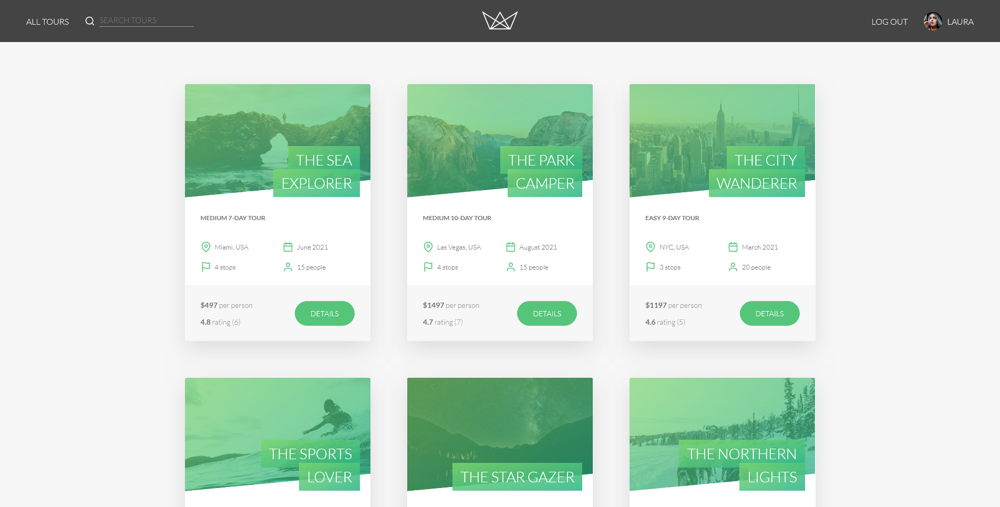
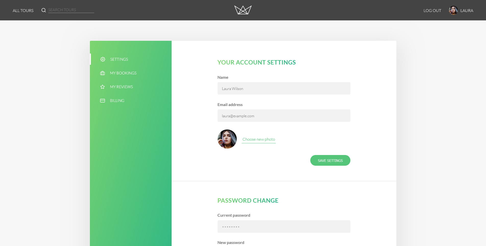
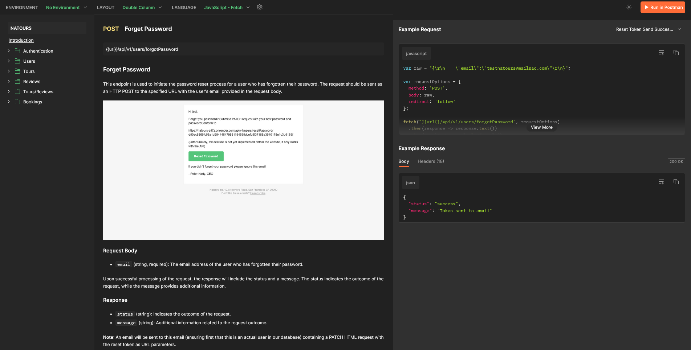

## Introduction

Welcome to the Natours web app! Natours is a platform designed to help users book their next tour. Whether you're looking for a thrilling adventure or a relaxing getaway, Natours has you covered.

### &emsp;[Check Out The Live Demo💻](https://natours-z47z.onrender.com/)&emsp;| &emsp;[Explore The Full API Documentation in Postman📄](https://documenter.getpostman.com/view/24915288/2sA35LWfMa)

## Features

Natours offers a range of features to enhance your tour booking experience:

- **Fully Implemented Authentication**: Natours uses JWT (JSON Web Tokens) for authentication, ensuring secure access to user accounts and data. Users can sign up, log in, and reset their passwords using email.

- **Authorization**: The app implements authorization to control user access to different features and resources. Only authenticated users can perform certain actions, such as booking tours or editing their profiles.

- **Real-Life Payment Integration**: Natours offers real-life payment functionality for tour bookings. Users can securely make payments through the app, adding convenience to the booking process.

- **Comprehensive API**: Natours provides a fully-fledged API with CRUD operations for various resources. Each resource supports filtering, sorting, and projection, offering users flexibility in accessing and managing data.

- **Security Measures**:

  - **XSS Protection**: Natours mitigates XSS (Cross-Site Scripting) attacks by sanitizing user input and escaping potentially dangerous characters.
  - **NoSQL Injection Prevention**: The app protects against NoSQL injection by removing or escaping characters that could be used maliciously in MongoDB queries.
  - **HTTP Parameter Pollution (HPP) Attacks Prevention**: Natours prevents HTTP parameter pollution by disallowing duplicate query parameters, ensuring request parameters are handled correctly.
  - **Rate Limiting and Brute-Force Attack Protection**: The app implements rate limiting to protect against brute-force attacks.
  - **HTTP Security Headers**: Natours sets various HTTP security headers, including X-Content-Type-Options, X-Frame-Options, X-XSS-Protection, Strict-Transport-Security, and Content-Security-Policy, to enhance security and mitigate potential vulnerabilities.
  - **JWT Token Expiration and Health Checks**: Natours ensures the security of JWT (JSON Web Tokens) by setting expiration dates for both authentication and password reset tokens. Additionally, the app performs health checks on tokens to verify their validity before granting access.

- **MVC Architecture**: Natours follows the Model-View-Controller (MVC) architectural pattern, separating concerns for better code organization and maintainability.

- **Descriptive Error Handling**: Both the frontend and backend of Natours feature descriptive error handling, ensuring users receive clear and informative error messages when issues occur.

- **Server-Side Rendering with Pug**: Natours utilizes server-side rendering with the Pug templating engine for efficient rendering of dynamic content.

- **Optimized Asset Delivery**: The app optimizes asset delivery by bundling JavaScript files, optimizing uploaded images for faster loading, and using compression to reduce file sizes.

Natours is designed with security, performance, and user experience in mind, providing users with a seamless and enjoyable booking platform.

    
    

    
    

## Technology Stack

Natours utilizes the following technologies:

- **Backend**: Express.js
- **Database**: MongoDB (NoSQL)
- **Templating**: Pug
- **Frontend**: HTML, CSS, Vanilla JavaScript
- **Linting**: ESLint (Airbnb style guide)
- **Containerization**: Docker
- **Development Environment**: Docker Compose
- **Dependency Management**: npm

## Running the Project Locally

### Docker Container (Recommended)

1. Navigate to `.devcontainer/dockercompose.yaml` and configure MongoDB.
2. Add the database information to the `config.env` file.
3. Run the command `npm install` to install dependencies.
4. Run the command `npm run start` to start the project.

### Local Installation

If you have MongoDB and Node.js installed on your machine:

1. Navigate to the project directory.
2. Install dependencies by running `npm install`.
3. Provide database information in the `config.env` file.
4. Run the command `npm run start` to start the project.
